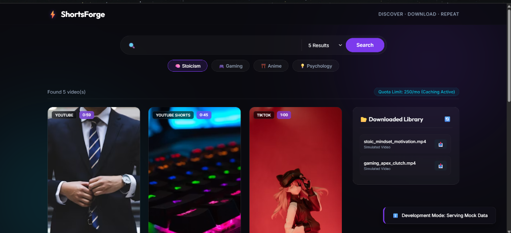

# ⚡ ShortsForge



ShortsForge is a premium, high-performance web application designed to help creators search, discover, and download short-form video content (YouTube Shorts, TikToks, and gaming clips) in one streamlined workspace. 

Featuring a modern glassmorphic interface, real-time download streaming via Server-Sent Events (SSE), and intelligent caching layer, ShortsForge provides a state-of-the-art UI/UX for creators who curate video libraries.

---

## ✨ Key Features

- **🌐 Cross-Platform Search**: Search and pull matching short video content using a curated, quota-safe SerpApi adapter.
- **⚡ SSE Live Streaming Progress**: Track download progress in real-time with smooth progress indicators powered by Server-Sent Events (SSE) direct from `yt-dlp`.
- **📂 Local Download Library**: Organize, preview, and download completed clips in the sidebar.
- **🛡️ Intelligent Caching Layer**: Minimize API overhead and boost performance with automatic front-end and back-end search caching (24-hour retention).
- **🎨 Modern Glassmorphism UI**: High-end styling using Outfit typography, HSL-tailored dark mode, skeleton loaders, and micro-animations.

---

## 🛠️ Tech Stack

- **Frontend**: Vanilla HTML5, Vanilla JavaScript (ES6+), Premium CSS Custom Properties (with responsive grid configurations).
- **Backend**: Node.js, Express.js.
- **Downloader Engine**: Python venv, `yt-dlp` library.
- **Search API**: SerpApi (Google Short Videos Engine).

---

## 🚀 Running ShortsForge

ShortsForge supports two running modes: **Mock/Static Mode** (default, ideal for portfolio hosting and free deployment) and **Live/Server Mode** (for full downlaoder capabilities).

### Option A: Static/Mock Mode (Zero-Config Portfolio Demo)
In this mode, the frontend acts as a static web application using a local database layer in [PUBLIC/mockData.js](file:///C:/AI%20Native%20founder/Projects/ShortsForge/PUBLIC/mockData.js). Downloads and search are simulated in the client browser with `localStorage` persistence.

1. **Verify Config**: Ensure `const USE_MOCK = true` is set in [PUBLIC/app.js](file:///C:/AI%20Native%20founder/Projects/ShortsForge/PUBLIC/app.js).
2. **Launch**: Simply open [PUBLIC/index.html](file:///C:/AI%20Native%20founder/Projects/ShortsForge/PUBLIC/index.html) in any browser, or host the [PUBLIC](file:///C:/AI%20Native%20founder/Projects/ShortsForge/PUBLIC) folder directly on a static hosting service like **Vercel** or **GitHub Pages**.

---

### Option B: Live Server Mode (Fully-Functional Downloader)
To run the active server backend, SerpApi search integration, and the Python `yt-dlp` download agent:

#### 1. Setup Backend Dependencies
Install node dependencies:
```bash
npm install
```

#### 2. Setup Python Virtual Environment
Initialize Python venv and install `yt-dlp` packages:
```bash
# Create virtual environment
python -m venv .venv

# Activate virtual environment (Windows)
.venv\Scripts\activate

# Install yt-dlp
pip install yt-dlp
```

#### 3. Configuration (`.env`)
Create a `.env` file in the root directory:
```env
PORT=3000
SERPAPI_KEY=your_serp_api_key_here
```

#### 4. Enable Live Mode
In [PUBLIC/app.js](file:///C:/AI%20Native%20founder/Projects/ShortsForge/PUBLIC/app.js), set `USE_MOCK = false` (line 6):
```javascript
const USE_MOCK = false;
```

#### 5. Start Server
Run the local Node server:
```bash
npm start
```
The server will boot up at `http://localhost:3000`.

---

## 📁 Project Structure

- `PUBLIC/` — Client-side source code (UI).
  - [index.html](file:///C:/AI%20Native%20founder/Projects/ShortsForge/PUBLIC/index.html) — Core DOM framework.
  - [styles.css](file:///C:/AI%20Native%20founder/Projects/ShortsForge/PUBLIC/styles.css) — Custom design system & animations.
  - [app.js](file:///C:/AI%20Native%20founder/Projects/ShortsForge/PUBLIC/app.js) — Simulated and live networking client logic.
  - [mockData.js](file:///C:/AI%20Native%20founder/Projects/ShortsForge/PUBLIC/mockData.js) — Rich mock datasets for offline search profiles.
- [index.js](file:///C:/AI%20Native%20founder/Projects/ShortsForge/index.js) — Express router, SSE streams, caching modules, and shell command runners.
- [package.json](file:///C:/AI%20Native%20founder/Projects/ShortsForge/package.json) — Backend dependencies list.
- `downloads/` — Target directory for downloaded media streams (ignored in Git).

---

## 💖 Acknowledgements & Credits

This project was created with the help of the **freeCodeCamp** video tutorial: [Build a Web Scraper/Downloader in Python & Node.js](https://youtu.be/j6hnjNhx_MM?si=d98i_mA0F6IP8EFM).

I am incredibly grateful for freeCodeCamp's constant efforts in providing high-quality, free programming education to developers around the world.

