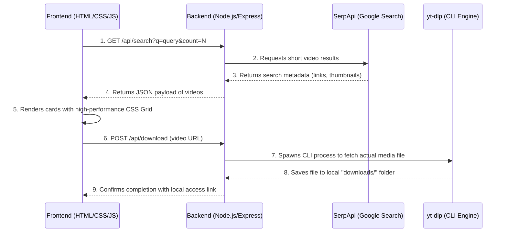

# Project Strategy & Architecture: Portfolio Video Scraper

An updated strategy document outlining the architecture, current codebase bugs, unique creative themes for your portfolio, and a step-by-step implementation plan.

---

## 1. Core Architecture: How it Works Under the Hood

To avoid "vibe coding," it is crucial to understand the clean separation of concerns and the exact flow of data in this application:



### Key Technical Pillars:
1.  **The Frontend:** Built with vanilla HTML5, CSS3, and JavaScript. 
    *   *No heavy frameworks:* This keeps load times near-zero and demonstrates clean DOM manipulation and modern CSS layout capabilities (Flexbox/Grid).
2.  **The Backend (Node.js & Express):** Serves as an API gateway.
    *   *Why?* The browser cannot directly query SerpApi (due to CORS policy and API Key exposure). The backend acts as a secure proxy.
3.  **The Downloader Engine (`yt-dlp`):**
    *   *How it works:* Short-form video platforms (like YouTube Shorts or TikTok) do not provide direct video file URLs (.mp4) in search results. Instead, they provide page URLs. The backend will spawn a `yt-dlp` command-line process to scrape the direct video streams, download the file, and save it locally.

---

## 2. Creative Themes to Make Your Portfolio Stand Out

A generic video scraper is common. An expertly themed aggregator, however, shows product design, domain interest, and target audience awareness. Here are four concepts:

### 💡 Theme A: The "Daily Wisdom" Philosophy Engine (Recommended)
*   **The Vibe:** Minimalist, academic, dark-academia aesthetic (black, deep gray, and warm gold accents).
*   **The Target:** Philosophy enthusiasts, creators looking for essay quotes, or people wanting bite-sized wisdom.
*   **Features:**
    *   Preset query filters (e.g., "Stoicism," "Existentialism," "Alan Watts," "Carl Jung").
    *   "Extract Transcript" button: Uses a secondary free API to show the textual wisdom alongside the video download.
    *   "Aesthetic Quotes" generator: Combines the philosophy clip with a typography layout.

### 🎮 Theme B: The "Clips & Clips" Gaming Highlights Hub
*   **The Vibe:** Cyberpunk, neon colors (violet, lime green), high contrast.
*   **The Target:** Gamers, highlight compilers, stream editors.
*   **Features:**
    *   Game selector grid (e.g., Valorant, Elden Ring, GTA V, Minecraft).
    *   Quality selectors: Allows picking 1080p, 720p, or extracting audio-only (.mp3) for background tracks.
    *   "Editor Package": Downloads the clip and a text file of its comments/likes for context.

### ⛩️ Theme C: The "Sakuga Selector" Anime Clip Database
*   **The Vibe:** Vibrant, modern anime layout (using clean red/white accents, smooth hover transitions).
*   **The Target:** Anime editors (AMV creators) looking for high-quality animation cuts (Sakuga).
*   **Features:**
    *   Filter by animation studios (e.g., Ufotable, MAPPA, Bones) or animators.
    *   Video loop preview: Seamlessly loops the short video thumbnail on hover.
    *   High-fidelity downloads optimized for video editing.

### 🧠 Theme D: The "Self-Discovery" Psychology Insight Tool
*   **The Vibe:** Clean, calm, therapeutic (soft blues, sage greens, light shadows).
*   **The Target:** Educators, lifelong learners, mental health advocates.
*   **Features:**
    *   Filters for cognitive biases, memory tricks, sleep hygiene, and body language.
    *   "Insight Summarizer": Generates a bulleted takeaways list based on the video description and tags.

---

## 3. The Implementation Plan (Simple & Polished)

Here is a step-by-step roadmap to clean up the code, implement the downloader, and polish the aesthetics:

### Phase 1: Code Remediation (Eliminating Bugs)
We will rewrite and fix the syntax errors currently blocking execution:
*   **Backend:** Correct the query slice logic and string template interpolation in [index.js](file:///c:/AI Native founder/Projects/Scrapping in Python/index.js).
*   **Frontend:** Fix variable scoping (`btn`), DOM element queries (`getElementById`), and bracket nesting errors in [app.js](file:///c:/AI Native founder/Projects/Scrapping in Python/PUBLIC/app.js).
*   **Styles:** Fix commas, unclosed brackets, typo properties (`aspect-ration`), and fonts in [styles.css](file:///c:/AI Native founder/Projects/Scrapping in Python/PUBLIC/styles.css).

### Phase 2: Implement the `/api/download` Route
We will enable actual file downloads on the local server:
1.  Verify `yt-dlp` is installed on the local system (or download the binary locally into the project).
2.  Use Node's `child_process.execFile` or `spawn` to run:
    ```bash
    yt-dlp -o "downloads/%(title)s.%(ext)s" <video_url>
    ```
3.  Return a success message containing the local file path so the frontend can display a clickable "Open File" button.

### Phase 3: Premium Design & UI Polishing
To make it portfolio-ready:
*   Introduce Google Fonts (e.g., *Outfit* or *Inter*).
*   Implement custom SVG icon badges for platforms (YouTube, TikTok, Instagram).
*   Add hover state micro-animations (e.g., cards lift up, buttons glow).
*   Ensure card dimensions match vertical layout constraints (ratio of `9/16` for shorts).
*   Add a visual search skeleton loader or spinner.

---

## 4. Current Code Bug Summary

For reference, the following bugs are currently present in your files:

| File | Line | Bug | Expected Fix |
| :--- | :--- | :--- | :--- |
| **[index.js](file:///c:/AI Native founder/Projects/Scrapping in Python/index.js)** | 33 | `(json.short_video_results \|\|).slice(...)` | `(json.short_video_results \|\| [])` |
| **[index.js](file:///c:/AI Native founder/Projects/Scrapping in Python/index.js)** | 40 | Single quotes instead of backticks | Use backticks for `${PORT}` interpolation |
| **[app.js](file:///c:/AI Native founder/Projects/Scrapping in Python/PUBLIC/app.js)** | 4, 5 | `getElementByID` | `getElementById` (lowercase d) |
| **[app.js](file:///c:/AI Native founder/Projects/Scrapping in Python/PUBLIC/app.js)** | 10, 62 | `.disable = true` | `.disabled = true` |
| **[app.js](file:///c:/AI Native founder/Projects/Scrapping in Python/PUBLIC/app.js)** | 33, 34 | `btn` referenced out of scope | Assign `btn` at start of `search()` |
| **[app.js](file:///c:/AI Native founder/Projects/Scrapping in Python/PUBLIC/app.js)** | 48 | `video.duration` | `v.duration` |
| **[app.js](file:///c:/AI Native founder/Projects/Scrapping in Python/PUBLIC/app.js)** | 57 | `searchButton.addEventListener` | `searchBtn.addEventListener` |
| **[app.js](file:///c:/AI Native founder/Projects/Scrapping in Python/PUBLIC/app.js)** | 61 | `getElementsById` | `getElementById` (singular Element) |
| **[app.js](file:///c:/AI Native founder/Projects/Scrapping in Python/PUBLIC/app.js)** | 77-83 | `catch` block placed inside `else` | Properly format try-catch nesting |
| **[index.html](file:///c:/AI Native founder/Projects/Scrapping in Python/PUBLIC/index.html)**| 7 | `<title>Short Video Scraper<</title>` | Remove extra `<` |
| **[styles.css](file:///c:/AI Native founder/Projects/Scrapping in Python/PUBLIC/styles.css)**| 1 | `*{ margin: 0, padding: 0... }` | Replace commas with semicolons |
| **[styles.css](file:///c:/AI Native founder/Projects/Scrapping in Python/PUBLIC/styles.css)**| 83 | Unclosed parenthesis in `repeat(...)` | Close properly: `repeat(..., 1fr)` |
| **[styles.css](file:///c:/AI Native founder/Projects/Scrapping in Python/PUBLIC/styles.css)**| 98 | `aspect-ration: 16/9;` | `aspect-ratio: 9/16;` (for vertical videos) |
